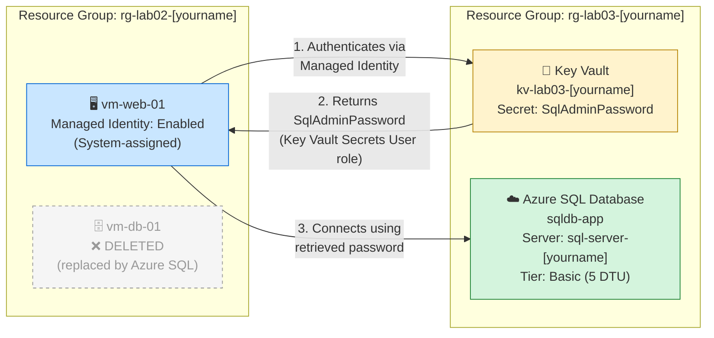

# Lab 03: Modernizing to PaaS & Securing Secrets

**Platform:** Microsoft Azure

**LOOM Video Link** 
https://www.loom.com/share/65c539c4e4d047a7ba81a181e5209f56

---

## 📌 Overview

This lab refactors the Lab 02 architecture by replacing a self-managed database VM with a fully managed **Platform as a Service (PaaS)** database, and introduces secure secrets management. By the end of this lab, the manually managed `vm-db-01` is decommissioned entirely, replaced by **Azure SQL Database**, with credentials stored in **Azure Key Vault** and retrieved by the web server via a **Managed Identity** — no password ever hardcoded or stored on the server.

**Key concepts practiced:**
- IaaS → PaaS migration ("lift and modernize")
- Azure SQL Database (fully managed relational database)
- Azure Key Vault for secrets management
- System-assigned Managed Identity
- RBAC role assignments (least privilege)
- Observability via Azure Monitor Metrics

---

## 🏗️ Architecture Diagram



**The flow:** `vm-web-01` uses its Managed Identity to authenticate to Key Vault and retrieve the SQL password, then uses that password to connect to Azure SQL Database. At no point is the password stored in code, in a config file, or anywhere on the server itself.

---

## ✅ Prerequisites

- [ ] Active Azure Subscription
- [ ] Lab 02 completed — `vm-web-01` running in `rg-lab02-[yourname]`
- [ ] Verify: **Resource groups → rg-lab02-[yourname] → vm-web-01 → Status: Running** (start it if stopped)

---

## 🏷️ Naming Conventions & Variables

| Resource | Name | Notes |
|---|---|---|
| Resource Group | `rg-lab03-[yourname]` | New RG for this lab |
| SQL Server | `sql-server-[yourname]` | Must be globally unique, all lowercase |
| SQL Database | `sqldb-app` | Exact name — do not rename after creation |
| Key Vault | `kv-lab03-[yourname]` | Must be globally unique |
| Region | Central US *(or your preferred region — keep consistent with Lab 02 resources)* | |

> **Why globally unique names?** SQL Servers and Key Vaults get public DNS hostnames (e.g., `sql-server-yourname.database.windows.net`). No two resources across all of Azure can share the same name.

---

## 🚀 Step-by-Step Instructions

### Phase 1 — Decommission the Old Database VM

Simulates the final step of a real-world migration: cut over, verify, then remove the legacy resource.

1. Go to **Resource groups → rg-lab02-[yourname]**.
2. Identify the three resources tied to `vm-db-01`: the VM itself, its OS disk, and its network interface (NIC).
3. Select all three (checkboxes) → **Delete** → type `delete` to confirm.
4. ⚠️ **Do not delete** the resource group or `vm-web-01`.
5. **Verify:** Refresh the RG — `vm-db-01`, its disk, and NIC are gone; `vm-web-01` remains.

> **Why delete instead of just stopping it?** A stopped VM still incurs cost for its disk and reserved IP. Full deletion is correct when a resource is no longer needed.

### Phase 2 — Deploy Azure SQL Database (PaaS)

1. Search **SQL databases** → **+ Create** dropdown → select **SQL database** (not the Free offer).
2. **Basics:**
   - If a "Free offer applied" banner appears, click **Remove offer** and confirm it's fully gone before continuing — the Basic DTU tier is unavailable while the free offer is active.
   - Resource group: *Create new* → `rg-lab03-[yourname]`
   - Database name: `sqldb-app` (clear any auto-filled name first)
   - Server: **Create new** →
     - Server name: `sql-server-[yourname]`
     - Location: your chosen region
     - Authentication method: **Use SQL authentication**
     - Server admin login: `sqladmin`
     - Password: create a strong password (8+ chars, upper/lower/number/special) — **write it down**, needed in Phase 4
   - Elastic pool: **No**
   - Workload environment: **Development** ⚠️ (defaults to Production, which forces an expensive Hyperscale tier)
   - Compute + storage → **Configure database** → purchasing model **DTU-based** → tier **Basic** (~$4.99/mo)
   - Free offer limit behavior (if shown): **Auto-pause the database until next month**
   - Backup storage redundancy: **Locally-redundant (LRS)**
3. **Networking tab:**
   - Connectivity method: **Public endpoint**
   - Allow Azure services and resources to access this server: **Yes**
   - Add current client IP address: **Yes**
   - Connection policy: Default · Minimum TLS: 1.2
4. **Security tab:** Enable Microsoft Defender for SQL → **Not now**
5. **Additional settings:** Use existing data: **None** · Collation: default
6. **Review + create** → confirm tier shows **Basic**, ~$4.99/mo estimate → **Create**.
7. **Verify:** Database Overview shows server name, `sqldb-app`, status **Online**.

### Phase 3 — Deploy Azure Key Vault

1. Search **Key vaults** → **+ Create**.
2. **Basics:**
   - Resource group: `rg-lab03-[yourname]`
   - Key vault name: `kv-lab03-[yourname]`
   - Region: match your other lab resources
   - Pricing tier: **Standard**
   - Recovery options: leave soft-delete at 90 days; **leave Purge protection disabled** ⚠️ (enabling it blocks cleanup later)
3. **Access configuration tab:** Permission model: **Azure role-based access control (RBAC)** (default — leave as-is). Leave the three resource-access checkboxes unchecked.
4. **Networking tab:** Enable public access: checked · Allow access from: **All networks** (fine for a lab; access is still controlled by RBAC).
5. **Review + create** → **Create**.
6. **Verify:** Vault Overview shows the Vault URI (`https://kv-lab03-[yourname].vault.azure.net/`).

**⚠️ Critical — grant yourself access before Phase 4:**
With RBAC as the permission model, *no one* has default access — including the creator.

1. In the Key Vault → **Access control (IAM)** → **+ Add** → **Add role assignment**.
2. Role: **Key Vault Administrator** → Next.
3. Assign access to: **User, group, or service principal** → select your own account.
4. **Review + assign** (twice to confirm). Wait 1–2 minutes for propagation.

### Phase 4 — Store the SQL Password as a Secret

1. In the Key Vault → **Objects → Secrets** → **+ Generate/Import**.
2. Name: `SqlAdminPassword` · Secret value: the SQL admin password from Phase 2 · leave activation/expiration unchecked · Enabled: **Yes**.
3. **Create**.
4. **Verify:** `SqlAdminPassword` appears with status **Enabled**.

### Phase 5 — Enable Managed Identity & Grant Key Vault Access

**Part A — Enable Managed Identity on the Web VM:**

1. **rg-lab02-[yourname] → vm-web-01 → Identity** (Security section).
2. **System assigned** tab → toggle **Status: On** → **Save** → confirm **Yes**.
3. **Verify:** An **Object (principal) ID** is generated — copy it.

**Part B — Grant the VM access to Key Vault via RBAC:**

1. In the Key Vault → **Access control (IAM)** → **+ Add** → **Add role assignment**.
2. Role: **Key Vault Secrets User** (read-only — least privilege) → Next.
3. Assign access to: **Managed identity** → **+ Select members** → Managed identity type: **Virtual machine** → select `vm-web-01`.
4. **Review + assign** (twice).
5. **Verify:** **Access control (IAM) → Role assignments** shows `vm-web-01` with role **Key Vault Secrets User**, Type **Virtual Machines**.

> If `vm-web-01` doesn't appear in the member picker, confirm Part A completed successfully and wait 60 seconds for propagation.

### Phase 6 — Validate with Azure Monitor

1. Search **SQL databases** → open **sqldb-app** (not the server — check the page header subtitle reads "SQL database").
2. Left menu → **Monitoring → Metrics**.
3. Metric: **DTU percentage** *(or **CPU percentage** if the database landed on the Free/Serverless tier)* · Aggregation: **Max**.
4. **Verify:** A chart renders with a visible line — even near-zero confirms the database is live and being monitored.

> In production you'd set alerts on DTU percentage to catch bottlenecks before they impact users. For this lab, seeing any data on the chart is the core observability habit being built.

---

## 🛠️ Troubleshooting

| Issue | Cause | Resolution |
|---|---|---|
| SQL Database creation fails | Server name already taken globally | Make the server name more unique (e.g., append a number) |
| Database landed on Free/Serverless tier | Free offer wasn't fully removed before configuring | Don't attempt to change tier post-deployment (vCore options can cost $400+/mo). Proceed using **CPU percentage** instead of DTU in Phase 6 |
| `vm-web-01` doesn't appear when assigning the Managed Identity role | Identity wasn't saved, or hasn't propagated | Confirm the Object ID exists under VM → Identity; wait 60 seconds and retry |
| "Unauthorized to view these contents" on Key Vault Secrets | Your account lacks an RBAC role on the vault | Assign yourself **Key Vault Administrator** via Access control (IAM); wait 1–2 minutes |
| Metrics chart shows no data | Database is newly created | Wait ~5 minutes and refresh |
| Database created with the wrong name | Auto-filled name field wasn't cleared | Azure doesn't support renaming — delete and recreate, selecting the existing server and entering `sqldb-app` |

---

## 📖 Key Concepts Recap

| Term | Definition |
|---|---|
| **PaaS** | Platform as a Service — provider manages the underlying infrastructure |
| **IaaS** | Infrastructure as a Service — you manage the VM and everything on it |
| **Azure SQL Database** | Fully managed relational database service based on SQL Server |
| **Azure Key Vault** | Secure store for secrets, keys, and certificates |
| **Managed Identity** | An Azure AD identity automatically assigned to a resource — no password required |
| **RBAC Role Assignment** | Granting an identity permission on a resource via a standardized role |
| **Key Vault Secrets User** | Built-in role granting read-only access to secret values |
| **Least Privilege** | Granting only the minimum permissions needed for a task |
| **Observability** | Monitoring metrics, logs, and traces to understand system health |
| **DTU** | Database Transaction Unit — blended measure of compute, memory, and I/O capacity |

---

## ✅ Lab Completion Checklist

- [ ] `vm-db-01`, its OS disk, and its NIC deleted from `rg-lab02-[yourname]`
- [ ] `vm-web-01` still running in `rg-lab02-[yourname]`
- [ ] Azure SQL Database `sqldb-app` deployed on the Basic tier in `rg-lab03-[yourname]`
- [ ] Azure Key Vault `kv-lab03-[yourname]` deployed in `rg-lab03-[yourname]`
- [ ] Secret `SqlAdminPassword` created and Enabled in Key Vault
- [ ] System-assigned Managed Identity enabled on `vm-web-01` with an Object ID present
- [ ] `vm-web-01` granted the **Key Vault Secrets User** role on the vault
- [ ] Azure Monitor Metrics chart confirmed showing DTU (or CPU) percentage for `sqldb-app`

---

## 🧹 Clean Up

Delete the Lab 03 resource group (removes the SQL Server, SQL Database, and Key Vault in one action):

```bash
az group delete --name rg-lab03-[yourname] --yes --no-wait
```

> ⚠️ Only delete `rg-lab02-[yourname]` if you're not continuing to Lab 04 — check its prerequisites first.

---

## 🎯 Key Takeaways

- Migrating from IaaS to PaaS shifts operational burden (patching, backups, availability) to the cloud provider — a common real-world modernization pattern.
- Secrets should never live in code or config files. Key Vault + Managed Identity removes the password from every layer except one secure, audited location.
- RBAC role assignments enforce least privilege distinctly per identity — the lab author gets full admin rights on the vault, while the VM gets read-only access to just the secret it needs.
- Observability isn't optional — confirming a resource is live and monitored is a baseline habit, not an afterthought.
